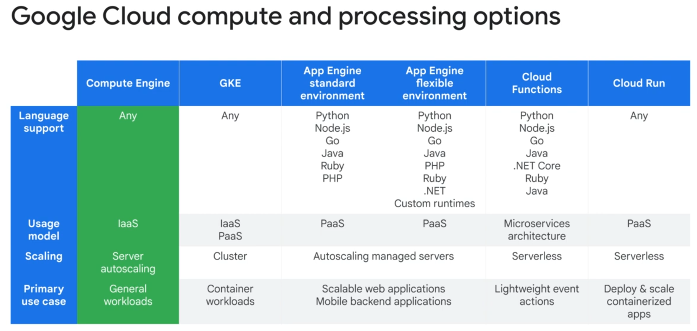
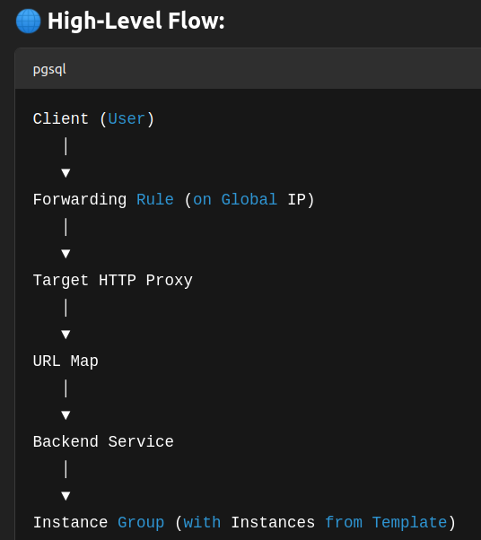
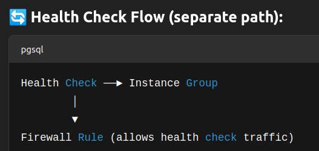
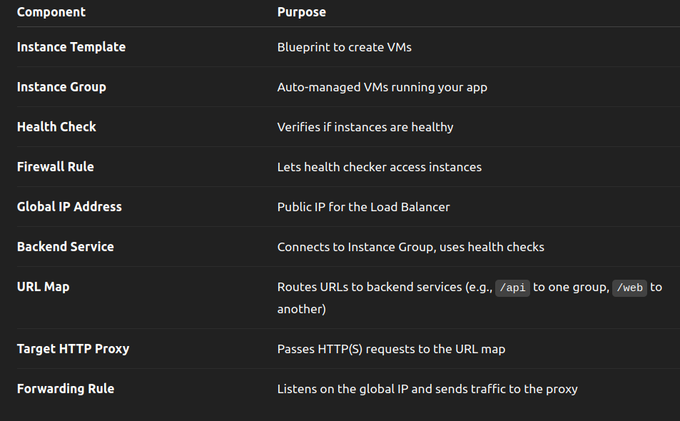
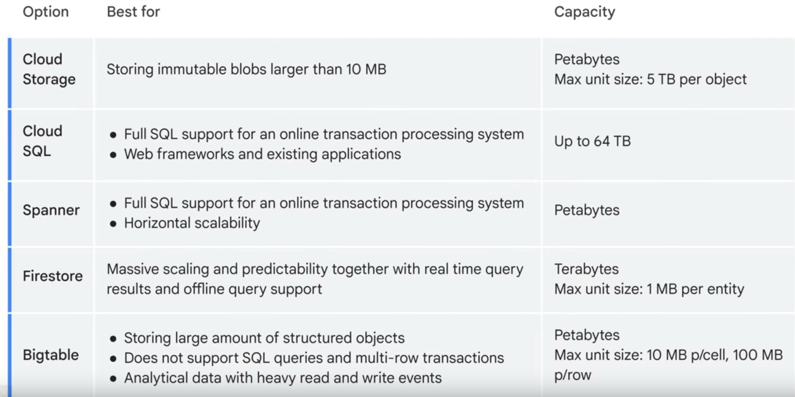

# Google Cloud Fundamentals: Core Infrastructure

- Compute, Storage, Big Data, ML, Application Services

    

- Quotas
    - Rate quota: x-amount/y-time, resets after y-time
    - Allocation quota: hard limits
- LBs
    - Application (L7) (reverse-proxy)
        - External
            - Global
            - Regional
        - Internal
            - Regional
            - Cross-regional

        

        

        
    - Network (L4)
        - Proxy (reverse-proxy)
            - External
                - Global
                - Regional
            - Internal
                - Regional
                - Cross-regional
        - Passthrough (do-not-modify incoming request, preserve original source-ip)
            - External
                - Regional
            - Internal
                - Regional

- On-prem connectivity
    - Datacenter:
        - IPsec:
            - Cloud VPN: Cloud-router with BGP makes routine easier, security concerns, issues with bandwidth reliability
        - VLAN attachment:
            - Dedicated Interconnect: Direct, private connection to Google, up-to 99:99% SLA, can use VPN as backup
            - Partner Interconnect: Access via a partner network. up-to 99:99% SLA for Google's part
            - Cross-Cloud Interconnect (10Gbps or 100Gbps)
    - Google API (e.g. Workspace, Youtube):
        - Direct Peering: Place a router at Google point of prsence
        - Carrier Peering: direct access from on-prem to VPC via a service provider network, Not-covered by Google SLA

- Storage
    - Data types:
        - Structured
        - Unstructured
        - Transactional
        - Relational
    - Storage:
        - Cloud Storage: object storage
            - Standard: hot data
            - Nearline: once per month
            - Cold: once per 3 months
            - Archive: once per year
        - CloudSQL: relational (mysql, postgres, mssql)
        - Spanner: SQL compatible, horizontically scalable
        - Firestore: NoSQL, horizontically scalable
        - Bigtable: NoSQL, suitable for over 1TB data

    

    - Prompt engineering:
        - Zero-shot
        - One-shot
        - Few-shot
        - Role prompting
    - Prompt
        - Preamble: Setting the stage (Context and instructions before the main question)
        - Input: Essential request
