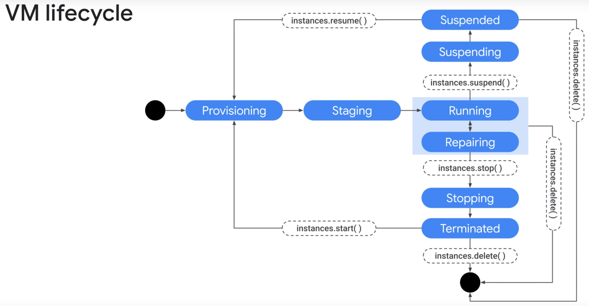
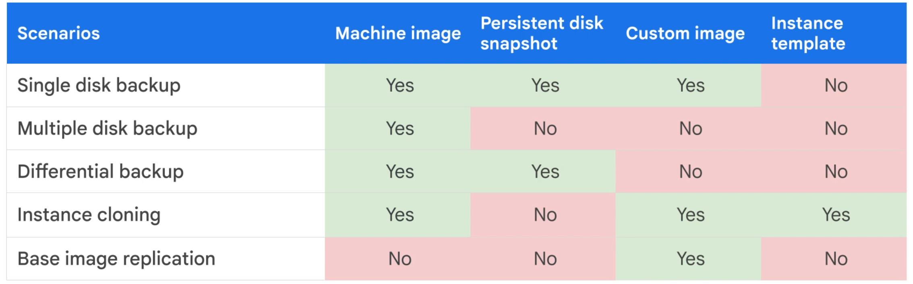
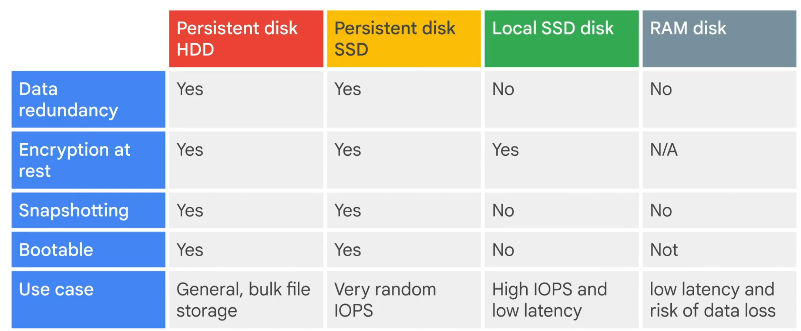
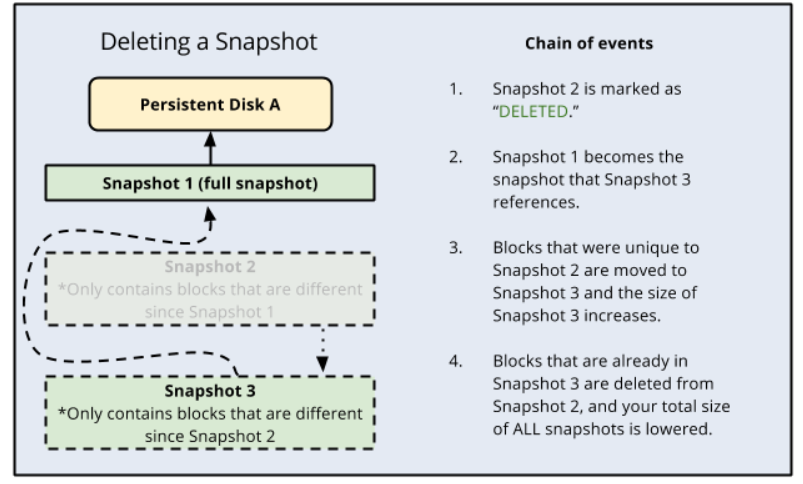

# Essential Google Cloud Infrastructure: Foundation

## Virtual Machines

- Life-cycle

    

- Machine types
    - family -> series -> type -> suffix
    - families:
        - general-purpose -> balanaced price/performance
        - storage-optimized -> analytics, vector dbs
        - compute-optimized -> Game servers, HPC
        - memory-optimized -> SAP HANA, Redis
        - accelerator-optimized -> AI, ML training
    - suffix:
        n/a: intel
        D: AMD
        A: Arm

- Shielded VMs
    - Secure Boot, vTPM, integrity monitoring

- Confidential VMs
    - Encrypts data, N2D Vms (AMD SEV; in-memory encryption)

- Images
    - Single-disk, Boot loader, OS, file system structure, software, customizations

- Machine Images
    - Multi-disk, captures the whole VM

    

- Disks
    - Disk throughput competes network egress/ingress throughput
    - Types
        - Hyperdisk -> Performance scales independently with IOPS and throughput, decoupled from disk size
            - Balanced
            - Balaanced High Availability
            - Extream
            - Throughput
            - ML
        - Persistent disk -> Must resize disk to increase performance
            - pd-standard (HDD)
            - pd-ssd (SSD)
            - pd-balanced (SSD)
            - pd-extream (SSD)
        - Local SSD (emphiral, survive instance RESET but not TERMINATE)
        - RAM disk (tmpfs)
        

- Actions
    - Move a VM to a different zone/region
    - Disk size -> Increase, NO shrinking
    - Snapshots
        - NOT available for local SSD
        - Can be restored to a new pd disk (e.g. from HDD -> SSD)
        - Does NOT backup VM's metadata, tags, etc.
        - In a case of snapshot deletion, GCP automatically shifts the necessary data to maintain the integrity of the remaining snapshot chain.
        
