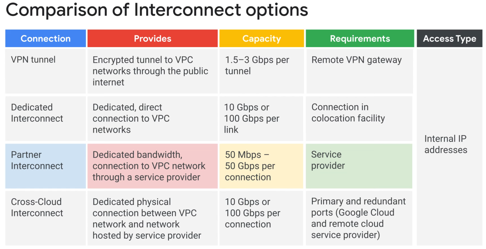
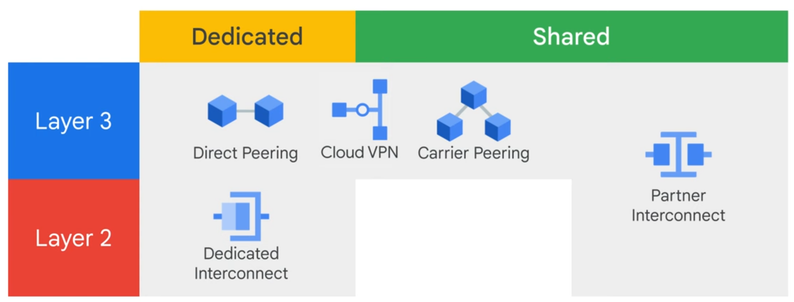
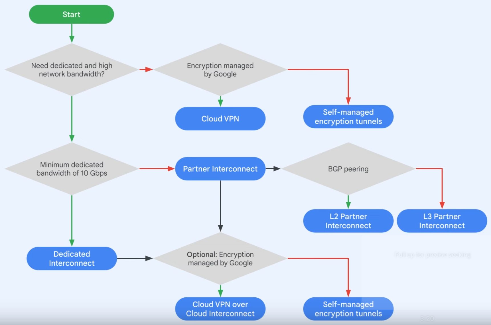
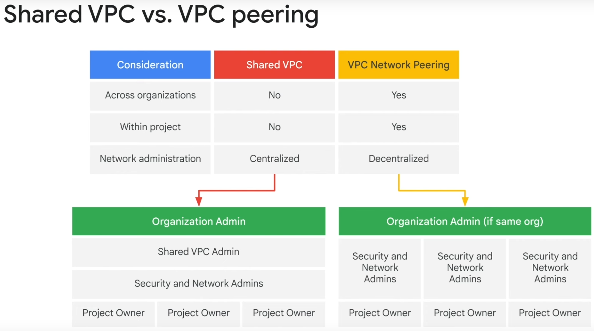
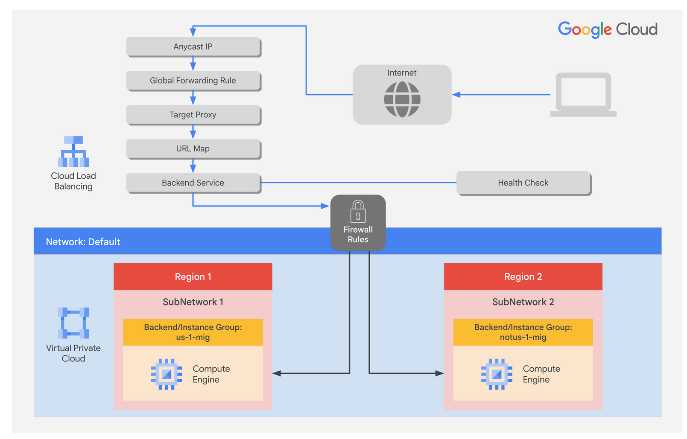
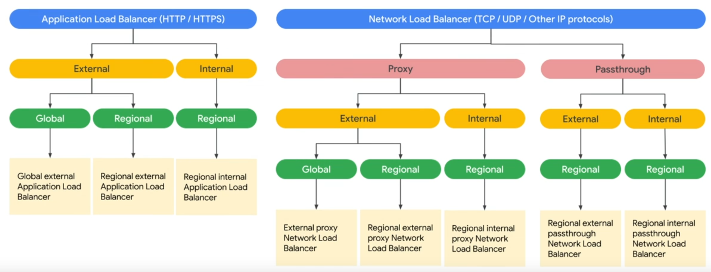
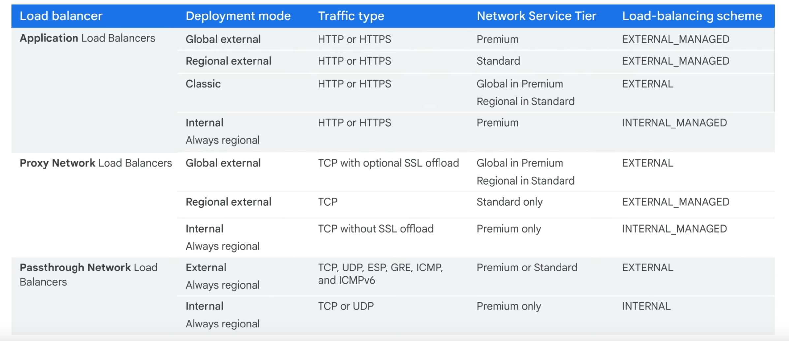
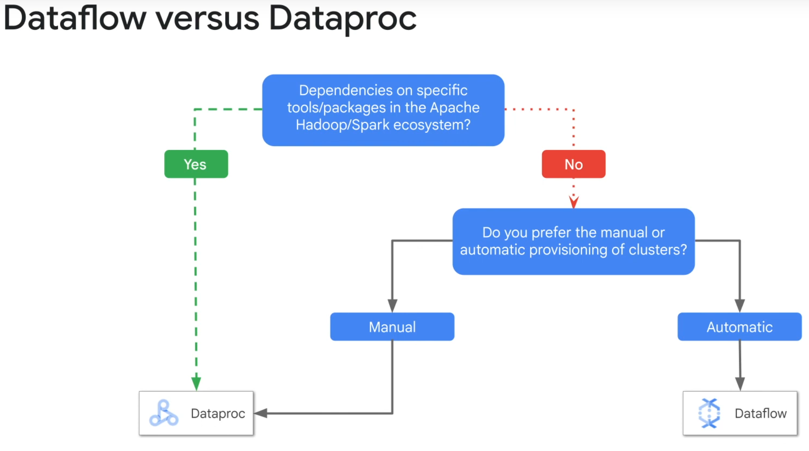

# Elastic Google Cloud Infrastructure: Scaling and Automation

## Interconnecting Networks

- Classic VPN
    - Regional per VPC
    - Two tunnels
    - Max MTU 1460 bytes

- HA VPN
    - Regional per VPC
    - Two or four tunnels
    - Must use BGP (assigned link-local address autoconfiguration (a.k.a. auto-IP): 169.254.0.0/16)
    - Supports active-active or active-passive
    - 3 typical topologies:
        - 1 HA VPN to 2 separate peer devices with each own IP addresses
        - 1 HA VPN to 1 peer device with two separate IP addresses
        - 1 HA VPN to 1 peer device with one IP address
    - Setup
        - Create VPN gateways
        - Create VPN tunnels
        - Create BGP peering for each tunnel (router interface per tunnel and then BGP peer per interface)

- Cloud Interconnect and Peering
    

    - Dedicated - Direct connection to Google
    - Shared - Connection to Google via a partner
    - Layer 2 - VLAN pipes directly to VPC's internal ip addresses
    - Layer 3 - Service access through public ip addresses (e.g. Google Cloud APIs, Youtube, Workspace)

- Cloud Interconnect (Access via RFC1918 connectivity)
    - Dedicated Interconnect
        - On-prem network must physically meet one of Google's Colocation facility

    - Partner Interconnect
        - When you on-prem network cannot meet one of Google's Colocation facility
        - On-prem --> Supported service provider --> Google's Colocation facility

    - Cross-Cloud Interconnect
        - 10Gbps or 100Gbps

    

- Peering (Access to APIs via public IPs)
    - Direct peering
        - No SLA
        - Connects to one of Google's Edge Points of Presence (PoPs)
    - Carrier Peering
        - Connects to one of Google's PoPs via a service provider

- Shared VPC
    - Host project
    - Service project(s)

- VPC Network Peering
    - Private RFC1918 connectivity between VPCs
    - No transitive peering
    - Supports peering between VPCs in different organizations

## Load Balancing and Autoscaling

- Managed Instance Groups
    - Supports stateful IP addresses

- Application Load Balancer
    

    - External or Internal
    - Global or Regional
    - HTTP: 80 or 8080
    - HTTPS: 443 (with HTTP3 and QUIC support)
    - IPv4 or IPv6
    - Autoscaling
    - URL maps
    - Backend services:
        - Health check
        - By default, roud-robin. But session-affinity can be configured
        - Timeout (default 30 sec)
        - Backend
            - Managed or unmanaged instance group
            - A balancing mode (CPU/RPS) - determines if the backend is at full usage
            - A capacity scaler - an addiontal control interacts with "balancing mode"
    - Cross-region load balancing
    - Content-based load balancing
    - NEG (Network Endpoint Group)
        - Zonal
        - Internet
        - Hybrid
        - Serverless
    - Supports Cloud CDN
        - Cache modes
            - USE_ORIGIN_HEADERS
            - CACHE_ALL_STATIC
            - FORCE_CACHE_ALL

- Network Load Balancer
    - Proxy load-balancing
        - External or Internal
        - Global or Regional
        - SSL
            - for encrypted, non-HTTP traffic
            - SSL traffic ends at LB
            - Thereafter either SSL or TCP
        - TCP
            - for unencrypted, non-HTTP traffic
            - TCP traffic ends at LB
            - Thereafter either SSL or TCP

    - Passthrough load-balancing
        - External or Internal
        - Regional
        - Non-proxied
        - Forwarding based on IP protocol data (ip address, protocol, port)
        - UDP or TCP or SSL (SSL doesn't terminate at LB)
        - Forwards traffic to either target pool or backend services

- IPv6 support
    - HTTP(S) LB, SSL proxy LB, TCP proxy LB
    - IPv6 terminates at the LB

    `_MANAGED` indicates the LB is using Google Front End and/or envoy proxy

## Infrastructure Automation

- Terraform

- Marketplace
    - Production-grade 3rd party solutions
    - Packaged using Terraform

## Data Analytics

- BigQuery
    - Data warehouse
    - SQL interface

- Dataflow
    - Data processing
    - Batch and stream
    - Apache Beam

- Dataprep by Trifacta
    - Explore, clean and prepare data
    - No-code

- Dataproc
    - Managed Apache Spark and Apache Hadoop clusters

- Data Fusion
    - CDAP
    - No-code

