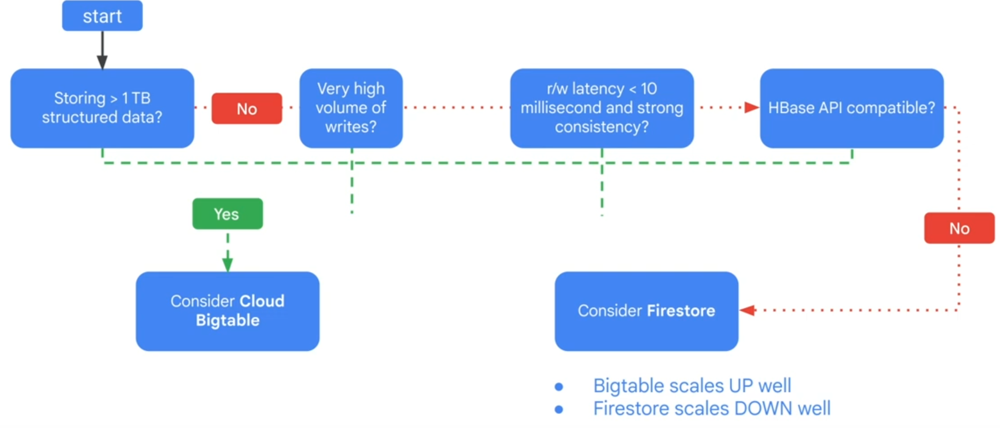

# Essential Google Cloud Infrastructure: Core Services

## IAM

- who, what, which
- what
    - Basic, Predefined, Custom
    - Permissions usually corresponds with REST API actions
- who
    - Google account, Google group, service account, Cloud Identity/Google Workspace domain
    - Policy Insights - ML based policy analyzer
    - "deny-rules" has higher priority than "allow-rules"
    - Service account
        - User-created
        - Built-in
        - Google API service accounts (run internal processes)
        - 10 keys per SA
        - Use keys as the last resort, use SA impersonation or short-lived SA credentials
        - Scopes
            - Legacy
            - Used to determin if an authenticated identity is authorized
            - Can be customized when creating an instance using "default" compute SA

## Storage and Database Services

- Cloud storage
    - regional, dual-regional, multi-regional
    - Can NOT change Geo location
    - IAM, ACLs, Signed URL, Signed Policy Document
    - Versioning, Soft Delete
    - Object retention
    - Lifecycle policies
    - Strong global consistency
    - Storage classes
        - Standard
        - Nearline
        - Coldline
        - Archive
        - (Auto class)
    

- CloudSQL
    

- Spanner

- AlloyDB

- Firestore (scales down well)
    - Datastore mode
        - For new "server" projects, backward compatible with datastore, strong consistent
    - Native mode
        - For new mobile/web apps, real-time updates, strongly consitent

    

- Bigtable
    - NoSQL, huge tables/wide column, adjusts to access patterns, spars (no data, no space), linear throughput, scales up well

    

- Memorystore
    - In-memory
    - Redis compatibility

## Resource Management

- Resource Manager
    - Policies: Top to down
    - Billing: Down to top
    - One billing account per project

- Quotas
    - Do not guarantee the resources are available

- Labels
    - Use defined key/val pairs, propogates to billing

- Billing
    - Labels (categorize) -> BigQuery (analyze) -> Looker Studio (dashboard)

## Resource Monitoring

- Monitoring

    

    - Metric scope
        - Scoping project
    - Dashboards
    - Alerts
    - OpsAgent
    - Custom metrics
    - Autoscale using metrics
        

- Logging
    - GCP and AWS
    - Log-based metrics
    - Can be sinked to GCS, BQ or streamed via Pub/sub

- Error Reporting

- Tracing

- Profiling

- Integrations
    - e.g. Bindplane to GCP, GCP to Splunk
