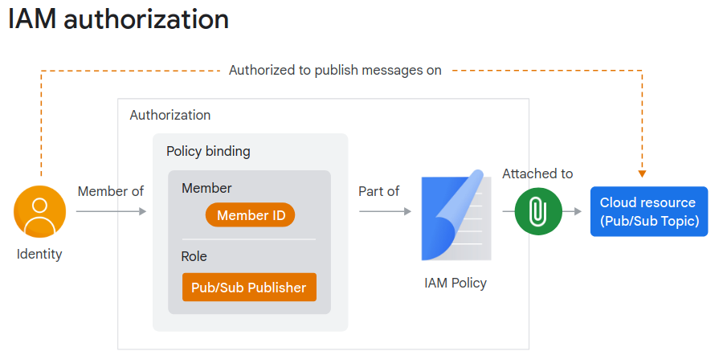

# Developing Applications with Cloud Run on Google Cloud: Fundamentals

## Fundamentals

- Overview
    - Regional managed service
    - Services
    - Jobs
        - Array jobs
        - One or more task(s) per job
    - Invoking
        - HTTPS
        - gRPC
        - WebSockets
        - Trigger from:
            - Pub/Sub
            - Cloud Scheduler
            - Cloud Task
            - Eventarc
    - Autoscale

- Resource model
    - Service
    - Revision

- Container lifecycle
    - Starting
        - A copy of the container image is in the internal storage for faster startup
    - Serving requests
        - Ready to serve, when  listens on TCP connections
        - Default mem limit: 512MiB
    - Idle
        - After 100ms, gets into idle if no serving
        - CPU is trottled --> no cost (however this can be changed)
    - Shutting down
        - Can be run a graceful shutdown script
        - 10s before the shutdown
    - Stopped

- Autoscaling
    - Scale up
        - Automatically scales
        - Up to 100 by default (the default project quota is 1000)
        - Understand the throughput of the downstream services when setting the number of max instances.
    - Scale down
        - To zero, however this can be change to set a min number of instance(s)
    - Concurrency (requests per instance)
        - by default 80

- Access control
    - Authorization
        

        1. IAM checks a policy that's "attached" to the resource
        2. If there's a "binding" that "allows", then the call is through

    - Network access
        - Ingress
            - All
            - Internal
            - Internal and Cloud LB
        - Egress
            - Direct VPC Egress
            - Serverless VPC Access

## Service Identity and Authentication

- Service Accounts
    - Do not have passwds
    - Can let someone act on behalf
    - Not members of Google Workspace domain, but can be added to groups
    - Best practice:
        - One service account per service identity
        - Minimum permission for the account
    - Protocols
        - OpenID Connect: authentication
        - OAuth: authorization

- Resource hierarchy
    - Org -> Folder -> Project
    - Resources inherit policy bindings from their parent and all their ancestors
    - Permissions granted at a higher level can't be taken away

- Principle of least privilege

## Application Development, Testing, and Integration

- Execution environment
    - v1
        - By default for services
    - v2
        - By default for Jobs (cannot be changed)
        - Supports Filestore

- Local development
    - Cloud Code
    - Emulators
    - gcloud
    - Docker

- Deployment
    - Image
        - Copies and stores locally
    - Service
        - One container per service
    - Revision
        - Immutable
        - Can be tagged (e.g. https://[my_tag].hello.a..run.app)
        - Trffic can be suspended initially with `--no-traffic`
        - Traffic can be pinned to make sure a specific revision is served
        - Traffic splitting

- Integration
    - Using client libraries
    - Using built-in integrations (e.g. secret manager, memorystore)
