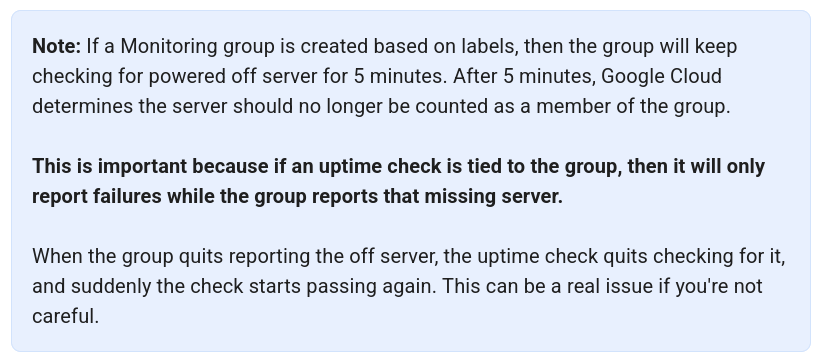

# Logging and Monitoring in Google Cloud

## Intro
- Operational
    - Cloud Logging
    - Cloud Monitoring
- Application
    - Application Performance Monitoring (APM)
        - Cloud Profiler
        - Cloud Tracer
- Four Golden Signals
    - Latency
        - Response time
    - Traffic
        - Number of X
    - Saturation
        - Percentage of X
    - Errors
        - Fails, exceptions

- Cloud Monitoring
    - Metrics through Prometheus and Open Telemetry
    - GKE -> Prometheus
    - Compute engine -> OpsAgent

- Cloud Logging

- Error reporting

- Cloud Trace

- Cloud Profiler

## Monitoring Critical Systems

- Cloud Monitoring Architecture
    - Collecting, processing, aggregating and displaying real-time quantitative data about a system.
    - 3-parts
        - Metrics collection
        - Metrics storage
        - Visualization and Analysis
    - Metrics scopes
        - Single or Multi project
        - Other tools (e.g. Error reporting, Tracer, etc.) does NOT respect metric scopes

- Cloud Monitoring Data Model
    - Time series data
        - metric
            - metric label
            - metric type
        - resource
            - resouce label
            - resource information
        - metricKind and valueKind
            - metricKind: how a metric's value changes over time or how it should be interpreted
                - guage: a value at a specific moment (e.g. cpu utilization)
                - delta: change in value over time (e.g. number of requests since last check)
                - accumalated: total that only goes up (e.g. sent bytes)
            - valueKind: tells you how data is stores
                - bool
                - int64
                - double
                - string
                - DISTRIBUTION (--> a group of values)
        - points: a single, individual measurement of a metric at a specific point in time.

    - Alignment: transforms raw, potentially irregularly spaced data points into a consistent, evenly spaced time series

- Query languages
    - PromQL
    - MQL

- Uptime checks

  

## Alerting Policies

- SLI, SLO and SLA
    - SLI: the number of good events divided by the count of all valid events
    - SLO: target value or range for a SLI
    - SLA: Agreement

- Alerting strategy
    - Error budget = `(Perfection) - (SLO)`
    - Timing --> when system is heading to spen all of its error budget before the allocated time window
    - Effectiveness
        - Precision: How many of the alerts are "actually real problems"
        - Recall: How many of the "real problems" actually the system catches
        - Detection time: How "fast" the system notices a problem "after it starts"
        - Reset time: How "fast" the system "clears" once the problem is "fixed"
    - Windows: used in two main ways in SRE
        - Time period of SLO
        - The period over which the error calculation is made
    - Alert window
        -  A small, fixed chunk of time inside your total SLO
    - Severity levels
        - What to prioratize

- Alerts
    - Alerting policy
        - Types
            - Metric based
            - Log based
        - Conditions
            - Threshold
            - Metrics absence
            - Forecast
        - Notifications (--> Notifications channels)
        - Documentation

- Service Monitoring
    - Why?
        - Commitments on the availability and performance
        - Inter-service dependencies
        - Check new code rollouts and triage problems
        - Look at the monitoring signals holistically
    - Types
        - Request-based --> looks at the individual requests
        - Window-based --> looks at groups of time
            - Downside: potential to hide bursts
    - Alerts
        - Burn threshold: how fast you detect when you're in trouble (=> burning the error budget)

## Advanced Logging and Analysis

- Overview
    - Collection -> Route -> Store -> Visualize & Analyze

- Collection
    - Platform logs
        - by Google services (e.g. VPC flow logs)
    - Component logs
        - by Cloud provider software
    - Security logs
    - User-written logs
        - e.g. client libs, OpsAgent
        - GKE/Cloud Run --> stdout, stderr
    - Multi/Hybrid Cloud logs

- Route
    - Sinks
        - _Required
        - _Default
        - User-defined
    - Aggregations
        - Project-level
        - Folder-level
        - Org-level

- Store
    - Destinations
        - Cloud logging bucket
        - Cloud storage
        - BigQuery
        - via Pub/Sub --> 3rd-party apps
        - Splunk

- Query
    - Operators
        - NOT, OR, AND (--> precedence order)
        - OR, AND are short-circuit (evaluated from left to right, and the evaluation stops as soon as the outcome of the entire expression is determined)
    - Hacks
        - Search on an indexed field
        - Apply constraints
        - Be specific
        - Limit time range

- Analytics
    - Sends to BigQuery for analytics

- Log-based metrics
    - Log entries -> extract/count -> log-based metrics -> monitoring/alerts
    - Use-cases
        - Count the occurances
        - Observe trends
        - Visualize
    - Types
        - System-defined
            - "Counter" type only
            - At the project level
        - User-defined
            - Counter, Distribution, Boolean type
            - At the project or bucket level (regarless of the project)
    - Labels
        - Allows log-based metrics to contain a time series for each label
        - Types
            - Default
            - User-defined
    - Extractors
        - Label extractor: Pulls a piece of data from the log to use as a label (category).
            - Example: Extract the "status" field from a log so you can count how many are "200", "404", etc.

        - Value extractor: Pulls a numeric value from the log to use as the metric value.
            - Example: Extract the "response_time" field to measure how long requests took.

## Working with Audit Logs

- Cloud Audit logs --> what your org members did on your resources
    - Admin Activity (always on, 400 days)
    - System Event (always on, 400 days)
    - Data Access (disabled by default, except for BigQuery)
    - Policy Denied (generated by default)

- Access Transparency logs --> what Google employees did on your resource

- Data Access Logs
    - Admin Read
    - Data Read
    - Data Write
