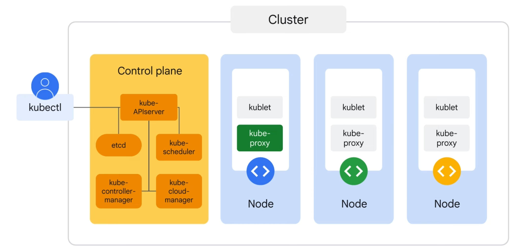

# Getting Started with Google Kubernetes Engine

## Intro

- Containers
    - Isolated user spaces for running application code

- Container images
    - Linux
        - Process: dedicated virtual memory address space
        - Namespace: controls what an app can see. e.g. process ids, directory trees, IP addresses
        - cgroups: controls the consumption of CPU, memory, IO
        - Union file system: Like an onion
            - The top layer is writable and emphemeral (--> container layer)

- Kubernetes
    - Is a set of APIs to deploy containers on a set of nodes
    - Configuration:
        - Declarative config --> here's the desired state (e.g. yaml)
        - Imperative config --> do this now

## Kubernetes Architecture

- Concepts
    - Object model
        - Types:
            - Containerized apps
            - Resources available
            - Policies affect
        - Elements
            - Spec: desired state
            - Status: Running state
    - Declarative mgmt
        - Achieved through a "watch-loop"

- Components

    

    - Control plane
        - kube-APIserver: accepts cmds for view or change state of the cluster/pods
        - etcd: stores the state of the cluster
        - kube-scheduler: responsible for scheduling the pods
        - kube-controller-manager: monitors the state of the cluster (running state vs. desired state)
        - kube-cloud-manager: interacts with underlying cloud providers

    - Nodes
        - kublet: k8s agent on the node, uses container runtime (e.g. containerd)
        - kube-proxy: maintains network connectivity

- Object Management
    - Object controllers
        - Deployments
        - StatefulSets
        - DaemonSets
        - Jobs

- GKE
    - Auto-pilot
    - Standard

## Kubernetes Operations

- `kubectl [command] [type] [name] [flags]`

- Introspection
    - Gathering information: `get`, `describe`, `exec`, `logs`
