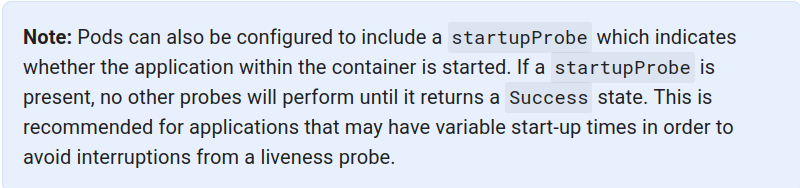
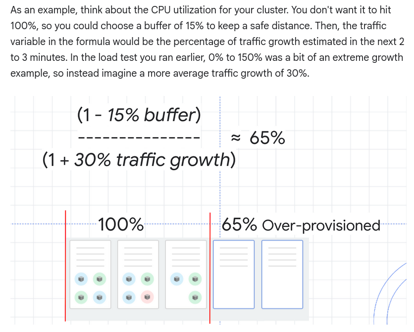

# Optimize Costs for Google Kubernetes Engine

## Tips

- Use namespace for segregation
- Disable unwanted addons
    - Horizontal Pod Autoscaler
    - kube-dns
    - Cloud Logging and Monitoring
    - Kubernetes Dashboard
- Optimize Pod Distruption Budget
- Exclude unwanted logs
- Use GKE usage metering
- Optimize metrics-server (--> `--scaledown-delay=24h`)
- Optimize kube-dns auto scaling
- Use Node auto-proviosning
    - To get around with Binpacking problem
- LimitRange --> At Pod or Cluster level
- Resource quotas --> At Namespace level
    

## Auto scaling

- Workloads
    - HPA
        - Choose the right buffer size
        - Minimize startup/shutdown time
        - Accurate ready and liveness probes
        - Monitor metrics server
    - VPA (Modes: Off, Initial, Auto)
        - Set limits, avoid large jumps
        - Ensure apps can handle restarts
        - Monitor the metrics server
    - Start with HPA, turn off VPA for recommendation collection

- Infrastructure
    - Cluster Autoscaler --> horizontacally
    - Node Auto-provisioner --> vertically

- Applications
    - Resources
        - Run in single replica mode (or Pod), do load testing (e.g. Locust) and figure out resource limits
        - Enable HPA or VPA, and test rapid loads (within a single zone to focus on app performance)
        - Set memory limit equal to memory request
        - Set cpu limit higher than cpu request (--> k8s will throttle the CPU to request limit if CPU in high demand)
    - Building Containers
        - Startup
            - Minimize image size
            - Minimize base image size
            - Minimize time between startup and ready
        - Shutdown
            - If SIGTERM is handled:
                - Readiness probe should fail
            - If SIGTERM is NOT handled:
                - Use PreStop hook
            - If really needed, set `terminationGracePeriodSeconds` (by default 30sec, can be up to 10 minutes)
            - Lifecycle
                1. Pod is set to the "Terminating" State and removed from the endpoints list of all Services
                2. preStop Hook is executed
                3. SIGTERM signal is sent to the pod
                4. Kubernetes waits for a grace period
                5. SIGKILL signal is sent to pod, and the pod is removed
    - Running on k8s
        - Pod Distruption Budget
        - Readiness probe
            - Simple
            - Isolated (--> no blockers)
            - Notes: unlike the liveness probe, an unhealthy readiness probe does not trigger the pod to restart.
        - Liveness probe
        - (Optional) Startup probe
        
        - Retry with exponential back-offs
        - Handle retry requests

- GKE
    - Batch
        - Separate node pool --> node auto-provisioning with spot VMs
        - Use the autoscaler profile, "optimize utilization"
    - Serving
        - Use "Pause Pods" to speed up startup time
        
    - Networking
        - NEG
        - Enable NodeLocal DNSCache
        - Fail Readiness probe as soon as SIGTERM is received
