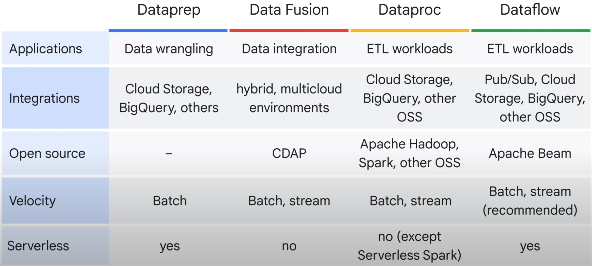

# Introduction to Data Engineering on Google Cloud

## Tasks and Components
- Role
    - Data pipeline: Replicate and migrate -> Ingest -> Transform -> Store
- Data sources vs data sink
- Data formats
    - Structured --> tabulated, relational, JSON, XML
    - Unstructured --> images, videos, audio, text

    

- Storage solutions
    - Data Lake --> stores raw, unprocessed data
    - Data Warehouse --> stores organized, processed data
    - Data Lakehouse --> Data warehouse + Data Lake

    
- Metadata management
    - Dataplex
- Sharing data
    - Analytics Hub

## Replication and Migration

- `gcloud storage`
- Storage Transfer Service
- Transfer Appliance
- Datastream --> continous via CDC for "structured" data

## Extract and Load (EL)

- `bq`
- BigQuery Data Transfer Service
- BigLake

## Extract, Load, and Transform (ELT)

- BigQuery
    - User-defined functions (UDFs)
        - SQL
        - Javascript
    - Stored Procedures
    - Remote Functions (BQ --> Cloud Run functions)
    - Jupyter Notebooks
    - Save queries and schedule
- Scripting (e.g. Python)
- Dataform
    - Within BigQuery
    - sqlx --> SQL + Javascript
    

## Extract, Transform and Load (ETL)

- Opensource
    - Dataproc
        - Managed Apache Spark and Hadoop
        - Dataproc Serverless for Spark --> fully managed Spark
            - Servelss for Spark batches --> `gcloud`
            - Servelss for Spark interactive session --> Jupyter Notebooks
    - Dataflow
        - Managed Apache Beam
        - Batch and Streaming
        - Streaming
            - Continuous ingestion through Pub/Sub
              - Data --> Pub/Sub --> Dataflow --> BigQuery/Bigtable
- UI-driven
    - Dataprep (by Trifacta)
        - Serverless, no-code data transformation
    - Data Fusion
        - Built on CDAP
        - Executes on Hadoop
        - Data Fusion Studio --> No-code

## Automation Techniques

- Cloud Scheduler
- Cloud Composer
- Cloud Run Functions
- Eventarc

## Example

