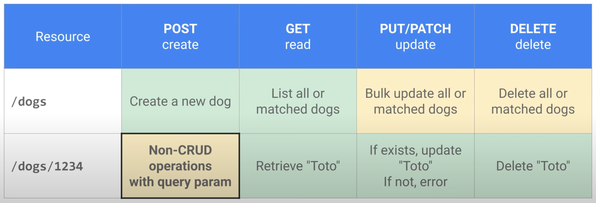

# API Design and Fundamentals of Google Cloud's Apigee API Platform

## Overview

- Architecture
    - API Runtime
    - Mediation --> parse, transform
    - API Analytics
    - Developer Ecosystem --> catalog, products, developer portal

- API lifecycle
    - Design --> OpenAPI specifications, API proxy stub
    - Develop --> Built in support for JavaScript and Java policies
    - Secure --> can be integrated with Cloud Armor, Identity Platform
    - Deploy
    - Publish -> full-featured Drupal-based portal or hosted integrated portal
    - Monitor
    - Analyze
    - Monetize

- Apigee Organization

## API-First and OpenAPI Specification

- HTTP verbs and CRUD

- Best practices
    - Keep verbs out of URLs --> Use primary HTTP verbs instead
    - For non-CRUD operations, use query parameter to perform an action
        - e.g. `POST /dogs/1234/?action=walk`
    - PUT vs PATCH
        - PUT --> completely replace the resource
        - PATCH --> partially update the resource (JSON Merge Patch)
    - Use query paramters instead of repetitive calls
        - e.g. `GET /dogs?location=park&state=running`
    - Patrial responses (--> for low bandwith or large responses)
        - e.g. `GET /dogs/1234?fields=id,name,nickName,color`

- Specs
    - History
        - JSON-based API documented using WADL
        - SOAP based APIs documented using WSDL
        - REST -> Swagger v1
    - OpenAPI

- API first
    - Ouside In thinking
