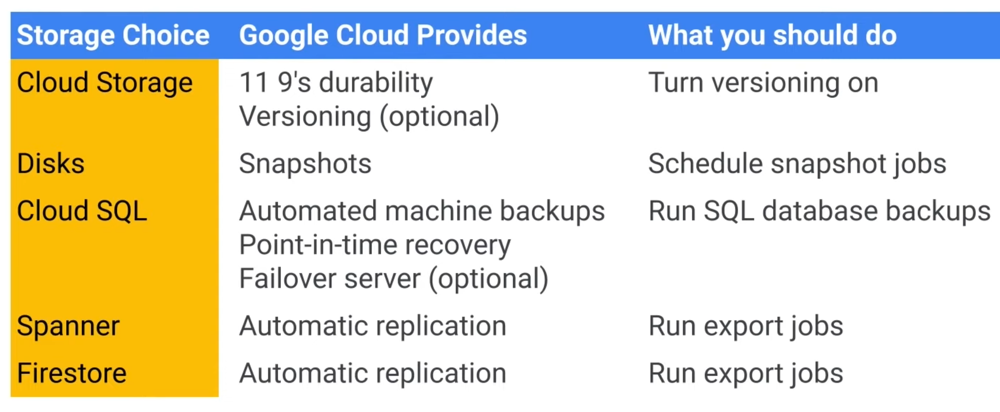

# Reliable Google Cloud Infrastructure: Design and Process

## Defining Services

- User personas
- User stories (--> qualitative requirements )
    - INVEST
        - I - Independent
        - N - Negotiable
        - V - Valuable
        - E - Estimatable
        - S - Small
        - T - Testable
- KPIs ( --> quantitative requirements)
    - Business KPIs
        - ROI
        - EBIT
        - Employee turnover
        - Customer churn

    - Technical KPIs ( --> quantitative requirements, used in SLOs)
        - Page views
        - User registrations
        - Clickthroughs
        - Checkouts

    - SMART
        - S - Specific
        - M - Measurable
        - A - Achievable
        - R - Relevant
        - T - Time-bound

- SLIs -> A measurable attribute of a service (--> basic properties of the metric to measure: API response time)

- SLOs -> A goal/target you want to achieve for a given SLI (--> the values of metrics should read: 95% of API responses < 300ms over 30 days)

- SLAs -> A binding contract with the customer (--> how to react if the metrics cannot be reached: e.g. if uptime < 99.9%, client gets a service credit)

## Microservice Design and Architecture

- Microservices
    - Stateless vs statefull
    - Loosely coupled
    - 12-factor app
        - Codebase
        - Dependencies
        - Config
        - Backing Services
        - Build, release, run
        - Processes
        - Port binding
        - Concurrency
        - Disposability
        - Dev/prod parity
        - Logs
        - Admin processes

- REST (Representational State Tranfer; request and response)
    - Protocol independent
    - Strong versioned contracts with backward compatibility
        - HTTP (--> OpenAPI)
            - CURD request
            - Body in text; JSON or XML
            - Resutls returned as JSON, XML or HTML
        - gRPC (--> protocol buffers)
    - API around the domain, not the use-case
    - Resources are identified by URIs/endpoints
    - Responses return an immutable representation of the resource

- HTTP
    - Request
        - Request line (a.k.a. URI)
        - Header
        - Body
    - Verbs
        - 9 verbs, but only 4 are used by REST
        - GET, POST, PUT, DELETE
    - Response
        - Code (e.g. 200s, 400s, 500s)
        - Header variables (e.g. content-type)
        - Body

- APIs
    - REST
    - gRPC

- Google services
    - API Gateway --> Fully managed, serverless (e.g. Cloud Run, App Engine)
    - Cloud Endpoints --> Proxy-based (e.g. GKE, compute engine)
    - Apigee --> Fullfledged API management

## DevOps Automation

- CI
    - Cloud source repos
    - Cloud build
    - Artifact registry
        - GKE Binary authorization
        - Kritis signer

- IaC
    - Terraform

## Choosing Storage Solutions

- Considerations

    - Type of data:
        - Binary data (object)
        - Relational data
        - Unstructured data (NoSQL)
        - Cache data (In-memory)
        - Aggregate data for queries and reports (Warehouse)
        - File

    - Availability
        - SLA --> Usually based on the configuration (e.g. single vs multi region)

    - Durability
        - Shared responsibility
        

    - Amount of data
        - read/write per X time

    - Read/write pattern
        - Strong consistent
            - Updates all copies of data within a transaction
            - GCS, CloudSQL, Spanner, Firestore, Bigtable (with no instance replication)
        - Eventually consistent
            - Updates one copy of data and the rest asynchronously.
            - Memorystore, Bigtable (default behavior)

    - Total cost per GB

    

- Data transfer to GCP

    - Cloud Storage Tranfer Service: Import small set of online data to GCS
    - Storage Transfer Service: Large-scale uploads
    - Transfer appliance
    - Data transfer for BigQuery

## Google Cloud and Hybrid Network Architecture

- VPCs
    - Auto, Custom
    - VPC, Shared VPC
    - A single VM can be attached to different VPCs
    - More vCPUs --> more vNICs

- Load-balancers
    - LB scheme is an attribute on the forwarding rule and the backend service and indicates if its internal or external
    

- Cloud Interconnect

- VPC Network Peering vs VPN

    

## Deploying Applications to Google Cloud

- Infrastructure as a Service
    - Instances
    - Managed Instances
    - Instance Templates

- Deployment Platforms
    - GKE
    - Cloud Run
    - Cloud Run functions
    - App Engine
        - Designed for microservices
        - One project : One App Engine

        

## Designing Reliable Systems

- KPIs
    - Availability: The percent of time a system is running and able to process requests
    - Durability: The odds of losing data because of a hardware or system failure
    - Scalability: The ability of a system to continue to work as user load and data grow

- Reliability
    - Single points of failure
        - N+2: one unit out for upgrade/testing
    - Correlated failures
        - Spread across failure domains
    - Cascading
        - Repair unhealthy (MIG health-checks, GKE readiness/liveness probes)
        - New instances start fast
    - Query of death overload
        - Rate limit
        - CPU/mem limits
        - Exponential backoffs
        - Circuit breaker
    - Positive feedback (retry) cycle overload failure
        - Exponential backoffs
        - Circuit breaker
    - Use data deletion mistake
        - Lazy delete

- Disaster planning
    - High-availablity
        - Instances
            - Regional MIGs
        - Database
            - HA
    - Cost
        - Running cost vs. Downtime cost
- Disaster recover
    - Cold standby
    - Hot standby
    - Disaster drills
    - RPO - Amount of data that would be acceptable to lose
    - RTO - Amount of time it takes to be back up and running

    

## Security

- Concepts
    - Principle of least privilege
        - Both for machines and processes
    - Segregation of duties
        - Prevention of conflict of interests
        - Detection of control failures
    - Tools
        - Audit logs
            - Admin
                - default retention: 400 days
                - bucket: `_Required`
            - System
                - default retention: 400 days
                - bucket: `_Required`
            - Data access
            - VPC flow
            - Firewall
        - Security Command Center

- People
    - IAM
    - Groups
    - Identity-Aware Proxy
        - App Engine
        - Compute Engine
        - Cloud Run
        - GKE (with ingress-gce)
    - Identity Platform

- Machines Access
    - Service Account: A both identity and a resource
        - As an identity, it's doing the work. You give the service account roles like "BigQuery Viewer" or "Storage Admin". So it can act and access resources, just like a person.
        - A a resource, it needs to be managed. Like giving someone the role Service Account User, so they can impersonate it or make a VM run as that service account

- Network
    - Remove external IP
        - Ingress: terminates at LB, 3rd party firewall (Proxy, WAF), API Gateway, IAP
        - Egress: Cloud NAT
    - Firewall rules
    - Control access to APIs
    - TLS only
    - DDoS protection
        - Global Application LB: In-built L3/L4 protection (SYN flood, IP fragment floods, port exhaustion)
        - Cloud Armor/WAF: L7 protection (cross-site scripting, SQL injections)
        - Cloud CDN: Absorb DDoS attack for cacheable content

- Encryption
    - Google encrypts at rest AES-256 symmetric key
    - Customer Managed Encryption Keys (CMEK)
    - Customer Supplied Encryption Keys (CSEK)
        - Can be used for Compute Engine(disk) and GCS

- De-identification
    - Data Loss Prevention (DLP) (-> a part of Sensitive Data Protection)

## Maintenance and Monitoring

- Version Management
    - Rolling updates
    - Blue/Green
    - Canary

- Cost Management
    - Capacity planning
        

    - Compute
        - Instance type
        - Commited user discounts
        - Spot VMs
        - Rightsizing recommendations
    - Disk
        - Disk size
        - IO patterns (related to disk type)
    - Network
        - Egress trafiic
        - Keeping data closer to the users
    - Storage
        - Storage offering
        - Disk type
    - Billing
        - Budget alerts
        - Billing reports
    - Architectural decisions
        - CDN
        - Memorystore

- Monitoring
    - Monitoring, Logging, Trace, Error Reporting, Profiler
    - Monitoring dashboards --> SLIs
    - Alerts --> (about to) breaching SLO
    - 4 Golden signals:
        - Latency: time it takes to respond to a request
        - Traffic: demand on the system (e.g. RPS)
        - Errors: rate of requests that fail (e.g. HTTP 5xx)
        - Saturation: how much burden the system is under (e.g. CPU, memory)
