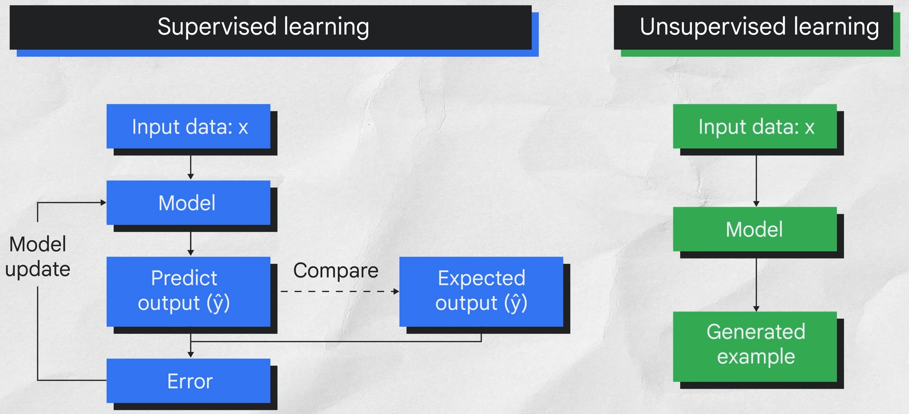

# Introduction to Generative AI Learning

## Intruduction

- Define
    - AI is a decipline of computer science
    - ML
        - A sub-field of AI
        - Data types
            - Supervised --> labeled data
            - Unsupervised --> unlabeled data
        
    - Deep Learning
        - A sub-field of ML
        - Uses artificial neural networks
        - Semi supervised --> a large amount of unlabeled data with a small amount of labeled data
    - GenAI
        - A sub-field of Deep Learning
    - Computer science > AI > ML > Deep Learning > GenAI
- Model types
    - Discriminative -->  "classify"
    - Generative --> "predicts"
- Applications
    - Foundation models --> uses large amounts of labeled, unlabeled, and semi-supervised data
        - Language
            - Chat
            - Text
            - Code
        - Vision
    - LLMs, LMMs, etc..
    - LLM
        - Hoallucinations
        - Prompts
    - Text to text
    - Text to image
    - Text to video
    - Text to 3D
    - Text to task

- Tools
    - Vertex AI --> comprehensive, end-to-end ML platform
        - Vertex AI Studio -> less-code
    - Gemini --> A family of AI models

## LLMs

- Definition
    - Large
        - Large training dataset
        - Large number of parameters
    - General purpose
        - Commonality of human language
        - Resource restriction
    - Pre-trainied and fine-tuned

- Prompts
    - Prompts design --> prompts are the input to the model
        - Best practices
            - Concise
            - Specific and well-defined
            - One task at a time
            - Turn Generative tasks into classification tasks --> guardrail
            - Include examples
        - Methods
            - Zero-shot
            - One-shot
            - Few-shot
    - Prompt engineering --> fine-tuning the model

- Types
    - Generic
        - Predicts the next
    - Instruction tuned
        - Predicts response
    - Dialoged tuned
        - Predicts next response

- Tools
    - Vertex AI Studio
        - Library of pre-trained models
        - Tool for fine-tuning models
        - Tool for deploying models

    - Vertex AI
        - Build Agents

    - Gemini
        - Multi-model
